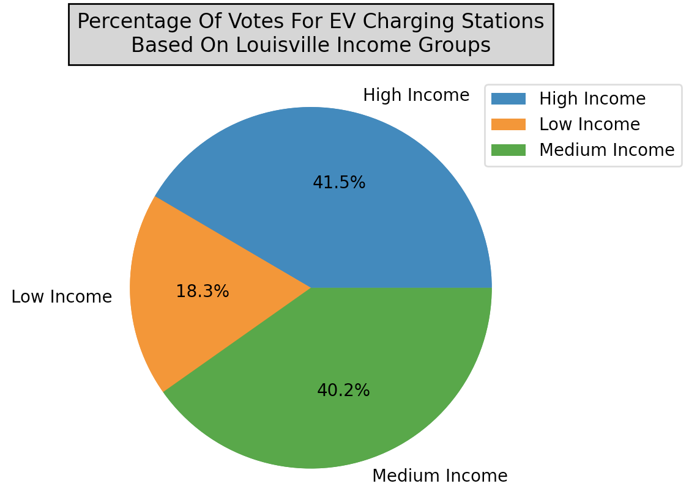
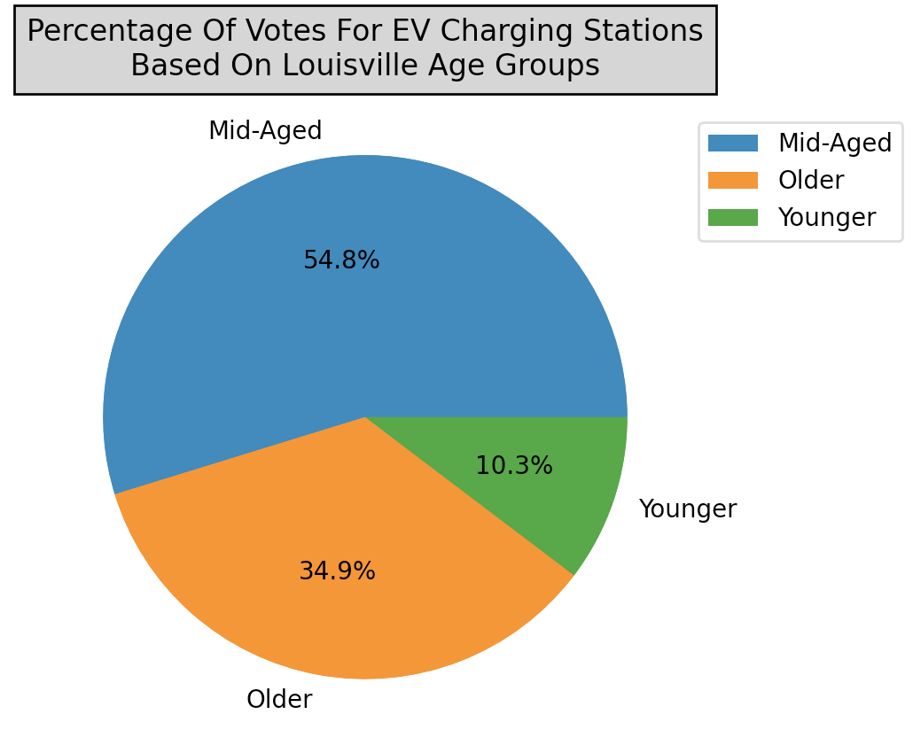
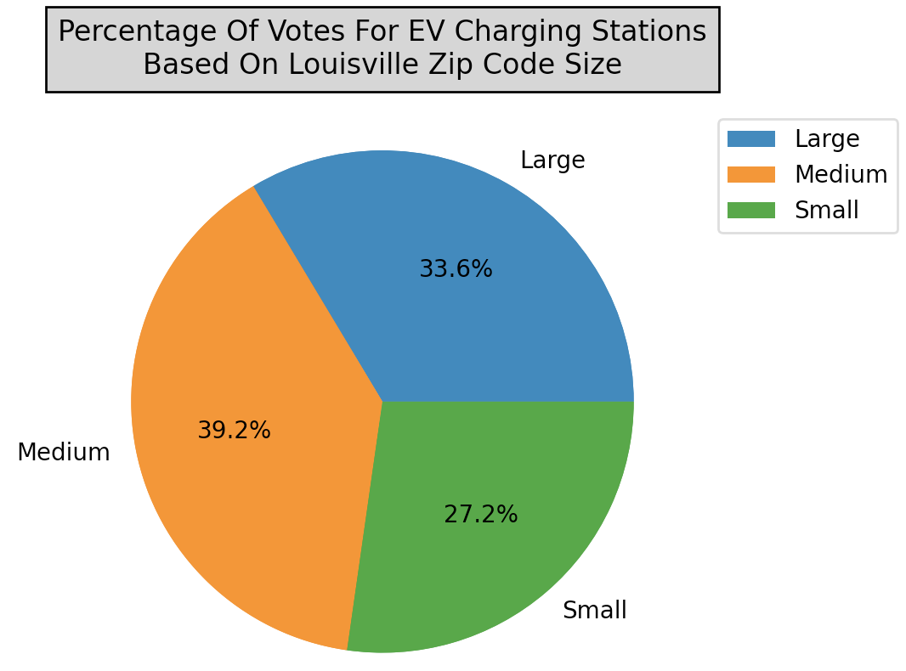
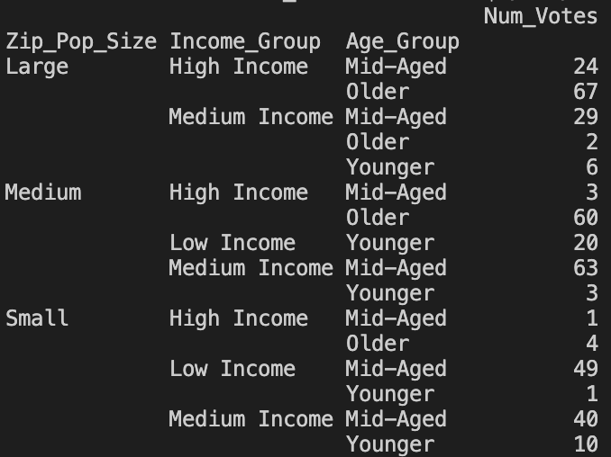

# [Louisville EV Charging Locations](https://github.com/stefanalytical/louisville_ev_locations.git)
_**This is a project for Code Louisville Data Analytics Session 2 Fall 2022**_

**Disclaimer**: Towards the end of the project I realized zip codes were not the best method to accurately map data. Going forward, I will use a combination of Federal Information Processing Systems (FIPS) codes and shapefiles in tandem with geopandas and will update this repository.

**This dataset was published to [Kaggle](https://www.kaggle.com/datasets/stefanalyst/louisville-ky-ev-locations?utm_medium=social&utm_campaign=kaggle-dataset) with a usability score of 10.0, the highest score.**

## About

As electric vehicles become more common place, the need for charging stations will grow substantially. In late 2017, Louisville Metro crowdsourced data to determine where Louisville Residents wanted EV charging stations most. In total, there were over 200 respondents that helped identify over 150 locations around the city for better EV charging infrastructure. These responses will allow the city to prioritize constructions internally and with third parties.

## Project Goals

In the simplest form, this project ingests, analyzes, and displays data. My goal was to merge CSV files and to scrape websites to create a new set of data that will give deeper meaning to the residents' votes. This allows one to better understand and visualize the desire for these new locations and to possibly find correlations between various variables. Ultimately, I wanted these questions answered:

1. Did any zip codes receive substantially more than others?
2. Did the zip code population size, age group, and income group in a zip code affect the number of votes received?
3. Did the correlation of specific variables in a zip code affect the number of votes?
4. What were the top 10 zip codes in terms of votes received and did the vehicle theft to votes ratio play a role?
5. When this data was visualized, what would it look like?

## Data Sources

CSVs:

- [crime_data_2021.csv](https://github.com/stefanalytical/louisville_ev_locations/blob/master/CSVs/crime_data_2021.csv)
- [louisville_evs.csv](https://github.com/stefanalytical/louisville_ev_locations/blob/master/CSVs/louisville_evs.csv)

Scraping:

- [Zipatlas.com](http://zipatlas.com/us/ky/louisville/zip-code-comparison/median-household-income.htm)
- [Localistica.com](https://localistica.com/usa/ky/louisville/zipcodes/highest-household-income-zipcodes/)

## Installation

This project was created using Python 3.10. If you need to download or update Python, you can do so on their [website](https://www.python.org/downloads/).

1. First, clone the repository: [louisville_ev_locations](https://github.com/stefanalytical/louisville_ev_locations.git) and save it to your machine using the command prompt. Navigate to the [louisville_ev_locations](https://github.com/stefanalytical/louisville_ev_locations.git) directory.

2. A virtual environment is required to run the program. Creation and activation will depend on the system you are using. Using the command prompt:

**To create the virtual environment:**

`python -m venv venv` <br />
or <br />
`python -m venv env`

**To activate the virtual environment:**

**Windows:** <br />
<br />`venv/Scripts/Activate` <br />
or <br />
`venv\Scripts\Activate` - (Powershell)

**Mac:** <br />
<br />`source venv/bin/activate` <br />
or <br />
`source env/bin/activate`

3. Once the virtual environment is activated, please install the project's dependencies found in the requirements.txt folder.

```bash
pip install -r requirements.txt
```
4. Run the file - This will create a pivot table and 3 pie charts.
```bash
main.py
```
<p float = "center">
  
  
  
</p>

<p float = "left">
  
</p>

5. Running `data_cleanup.py` will update the CSV file in the `clean_data` folder.

**Relevant packages that were used:**

- Pandas
- Matplotlib

## Visualizations

I created a Tableau story called [Desire for Electric Vehicle Charging Stations in Louisville, KY](https://public.tableau.com/views/LouisvilleEVs/Story1?:language=en-US&publish=yes&:display_count=n&:origin=viz_share_link) that visualizes the merged and cleaned data and then analyzes it. Two CSV files and data scraped from two websites are ingested and cleaned by `data_cleanup.py`, and are then saved to the `clean_data` folder. This is the text file used to create the story.

## Findings

I analyzed the data and visualizations on my Tableau story found in the link above. In this section I will discuss the pie charts, pivot table, and the questions I asked in the **Project Goals** section. Based on the income group pie chart, both medium-income (Annual income between $20000 and $50000) and high-income (Annual income over $50000) zip codes accounted equally for the percentage of the votes (40.2% and 41.5% respectively). There are substantially less votes for locations in low-income areas. When looking at the pie chart dealing with age groups, it becomes clear that the majority of votes were located in mid-aged (Ages between 35 and 40) zip codes even though that group had the smallest range compared to the younger group (Under 35) and the older group (Over 40). The mid-aged zip codes seemingly have enough money for electric vehicles while also displaying interest in innovative technologies. Lastly, the pie chart displaying the percentage of votes based on zip code sizes is almost evenly split three ways. The small group (Under 15k residents) makes up 27.2%, the medium group (Between 15k and 30k residents) makes up 39.2%, and the large group (Over 30k residents) makes up 33.6%. It is safe to assume that zip code population size did not have an effect on the number of votes received. The created pivot table allows for a quick drill-down to see how votes are distributed. The aggregated vote values become smaller toward the bottom of the table.

1. **_Did any zip codes receive substantially more than others?_**

- 40207 and 40202 had 52 and 49 votes respectively. This makes up 27% of the total votes received. The next zip code with the most votes, 40205, had 33 votes.

2. **_Did the vehicles zip code population size, age group, and income group in a zip code affect the number of votes received?_**

- This question was answered in detail in the paragraph above under Findings.

3. **_Did the correlation of specific variables in a zip code affect the number of votes?_**

- The relationship between the vehicle thefts per zip and zip income variables was highly statistically significant but had a low or weak effect size. 30% of the variation of one variable was completely explained by the other. On the other hand, the relationship between the zip code age and zip code income variables had a moderate effect size, with 53% of the variation of one variable being completely explained by the other. This correlation is also highly statistically relevant with a (p<.0001) value.

4. **_What were the top 10 zip codes in terms of votes received and did the vehicle theft to votes ratio play a role?_**

- In order from most voted received to least: 40207, 40202, 40205, 40206, 40203, 40204, 40222, 40241, 40219, 40213. When I calculated the top ten zip codes with the best theft to votes ratios, with the highest ratio being the most ideal, I found that all ten zip codes with the most votes could also be found in the top ten best ratio group. This can be seen in greater detail on the last dashboard in my Tableau story.

5. **_When this data was visualized, what would it look like?_**

- When looking at the visualized data, it quickly becomes clear that the majority of votes for locations are concentrated inside the I-264. 65% of votes are located in this area. 41% of votes are located in zip codes that border the Ohio River.


## Project Requirements

**Category 1: Loading Data:**

- Read TWO data files (CSV).
- Scrape TWO pieces of data from anywhere on the internet and utilize it in your project.	

**Category 2: Clean and Operate the Data While Combining Them:**

- Clean your data and perform a pandas merge with your two data sets, then calculate some new values based on the new data set.


**Category 3: Visualize/Present Your Data:**

- Make a [Tableau dashboard](https://public.tableau.com/views/LouisvilleEVs/Story1?:language=en-US&publish=yes&:display_count=n&:origin=viz_share_link) to display your data.
- Make at least 1 Pandas pivot table and 1 matplotlib/seaborn plot.

**Category 4: Best Practices:**

- Utilize a virtual environment and include instructions in your README on how the user should set one up.
- List dependencies in a requirement.txt file.


**Interpretation of Your Data:**

- Annotate your .py files with well-written comments and a clear README.md.